# RepoAgent 项目设计文档

- 版本：v0.2（实现与设计对照）
- 日期：2026-10-07
- 定位：面向 Agent 开发实习的 Coding Agent 工程项目。本文保留原始设计契约；第 16 节记录实际实现和验证边界。

## 1. 项目目标

用户指定本地 Git 仓库和自然语言需求，系统在独立工作区中探索代码、执行修改、运行测试，根据反馈继续修复，最终交付补丁、验证结果和可追溯的执行记录。

示例输入：

> 修复这个 Python 项目中分页参数为负数时返回异常的问题，保持正常分页行为，补充边界测试。

示例输出：任务状态、修改摘要、patch.diff、执行过的测试及退出码、未验证事项、步骤数、Token 用量和耗时。模型调用费用仅在配置了对应价格时估算，否则显示未知。

核心价值：可靠的工具执行、工作区隔离、状态恢复、上下文管理和可复现验证。第一阶段使用现成模型 API，不训练模型。

## 2. 范围与约束

### 2.1 首个可交付版本

- 用户单、单 Agent、单任务运行，CLI 入口。
- 支持用户明确指定的本地 Python Git 仓库及 pytest 项目。
- 以用户提供的 commit（默认 HEAD）为基准创建独立工作副本；拒绝默默遗漏未提交改动。源仓库脏时提示先提交，后续再支持导入工作区快照。
- 所有项目代码、依赖安装脚本、测试与 Shell 命令在 Docker 内执行。
- 内置文件搜索、分段读取、补丁编辑、命令执行、测试和 Diff 工具。
- 支持步骤/时间/Token 预算、取消、日志、补丁导出和基础恢复。
- 本地 SQLite 保存任务索引和事件，文件目录保存输出、快照和补丁。

### 2.2 后续扩展

Repo Map、FastAPI/SSE、多任务排队、MCP 外部工具、Java/Maven/JUnit、GitHub Issue 和 Draft PR 交付。

### 2.3 暂不纳入

自动寻找 GitHub 项目、任意语言自动配置环境、IDE 插件、多租户、复杂前端、多 Agent 编排、模型训练和完整企业平台。

Git Worktree 仅隔离代码变更，不是命令安全边界。MVP 直接使用 Docker；不以宿主机执行项目代码作为默认降级方案。

## 3. 架构与技术决策

```mermaid
flowchart TD
    CLI[CLI / 后续 FastAPI] --> S[TaskService]
    S --> O[任务编排器]
    O --> A[单 Agent Loop]
    A --> C[ContextBuilder]
    A --> L[ModelGateway]
    A --> T[ToolRuntime]
    T --> P[Policy 参数与执行策略]
    P --> D[DockerSandbox]
    D --> W[独立 Git 工作副本]
    O --> V[VerificationRunner]
    V --> D
    O --> CP[CheckpointManager]
    CP --> W
    O --> DB[(SQLite / 事件 / 产物)]
    T --> DB
    O --> R[报告与补丁]
```



| 决策 | 初始选择 | 理由与边界 |
|---|---|---|
| 语言 | Python 3.11+ | 与现有学习积累衔接 |
| 包管理 | uv + pyproject.toml + uv.lock | 环境可复现，依赖已锁定 |
| 模型接入 | httpx + OpenAI 兼容 Chat Completions JSON 协议 | 模型、地址、密钥通过环境变量选择；其他端点需确认 JSON 模式兼容性 |
| Agent 编排 | 手写显式循环 | 先完整掌握循环、错误与终止逻辑；MVP 不同时维护 LangGraph 第二套状态 |
| 数据契约 | Pydantic | 校验任务、工具、模型动作与事件 |
| 搜索 | Python 文件扫描；Python AST/Java 定义索引 | 小仓库可用；大型仓库可再换 rg/Tree-sitter |
| 执行环境 | Docker CLI，Linux 容器 | Windows 开发使用 Docker Desktop Linux containers |
| 持久化 | SQLite + 本地产物目录 | 单机串行任务够用，先避免引入 Redis/PostgreSQL |
| 服务入口 | CLI，后续 FastAPI + SSE | 先验证执行闭环，再服务化 |
| 测试 | pytest + Docker 集成测试 | 模型协议可用固定响应替身验证 |

主模型依据任务执行结果动态选择下一步；外围的准备、审批、持久化、验证和交付由确定性代码控制。禁止让模型直接决定数据库状态或绕过执行策略。

## 4. 模块职责与目录

```text
RepoAgent/
├── pyproject.toml
├── uv.lock
├── .env.example
├── README.md
├── docs/项目设计文档.md
├── configs/default.yaml
├── docker/python/Dockerfile
├── src/repoagent/
│   ├── cli.py
│   ├── config.py
│   ├── contracts.py
│   ├── service.py
│   ├── agent/          # loop、prompt、model_gateway、context、budget
│   ├── tools/          # registry、schemas、file、search、patch、command
│   ├── runtime/        # dispatcher、policy、cancellation
│   ├── sandbox/        # interface、docker、workspace
│   ├── repository/     # git、index、repomap
│   ├── persistence/    # database、events、checkpoints
│   ├── verification/   # runner、profiles、report
│   └── api/            # 第二阶段 routes、events
├── tests/unit/
├── tests/integration/
├── tests/fixtures/     # 小型可控 Python 仓库
└── evaluations/       # manifest、runner、汇总报告
```

运行产物默认位于可配置的 `data/tasks/<task_id>/`，不提交 Git，包含 workspace、artifacts、checkpoints。源仓库不挂载进容器。上图是最初的目标目录；实际代码采用较少的模块，见 `src/repoagent/`、`tests/`、`docker/`。

依赖方向：入口 → TaskService → 编排器 → Agent/Runtime/验证/持久化；Agent 依赖抽象模型接口和工具规格，不直接依赖 Docker、HTTP 或 SQLite。Runtime 调用 Sandbox 接口，方便后续替换执行环境。

## 5. 核心契约

以下是语言无关字段约定，实际实现使用 Pydantic 类型。

```text
TaskSpec
  task_id, repo_path, base_commit, instruction
  verification_profile, sandbox_profile, budgets

TaskState
  status, phase, step, last_event_seq
  workspace_ref, latest_checkpoint_id
  pending_tool_call_id, budget_usage, cancellation_requested

ModelAction
  kind: tool_call | finish | ask_user
  tool_call: {call_id, name, arguments}
  finish: {summary, limitations}
  ask_user: {question}

ToolResult
  call_id, ok, error_code
  output_excerpt, artifact_ref, exit_code
  duration_ms, truncated, workspace_changed

Event
  task_id, seq, event_id, timestamp, type
  call_id?, checkpoint_id?, payload

VerificationReport
  command, environment_ref, commit_ref
  exit_code, timed_out, report_artifact
  passed?, failed?, skipped?, baseline_comparison
```

`ok` 表示工具协议执行成功；命令退出码非零不等于工具系统崩溃。模型请求结束只产生候选完成状态，必须由 VerificationRunner 判断能否交付。

主要接口：

```python
ModelGateway.next_action(messages, tool_schemas, budget) -> ModelAction
ToolRuntime.execute(task, tool_call) -> ToolResult
Sandbox.exec(argv, cwd, timeout, env) -> ExecutionResult
ContextBuilder.build(task, events, repo_summary) -> Messages
CheckpointManager.create(task, event_seq) -> CheckpointRef
CheckpointManager.restore(task, checkpoint_id) -> RestoreResult
VerificationRunner.run(task, profile) -> VerificationReport
TaskService.create(spec) / run(task_id) / cancel(task_id) / resume(task_id)
```

模型适配器可接收多个工具请求，但首版按顺序执行，并保留每个调用 ID 与结果的关联。参数格式失败返回可修正错误；连续协议错误达到上限后结束任务。

## 6. 执行过程与状态机

任务状态：`QUEUED → PREPARING → RUNNING → VERIFYING → SUCCEEDED`。

其他状态：`WAITING_USER`、`FAILED`、`CANCELLED`、`BUDGET_EXCEEDED`、`INTERRUPTED`。VERIFYING 失败且预算允许时回到 RUNNING；需求不明确或必须批准的动作进入 WAITING_USER。恢复时先检查运行记录、工作区、容器和快照是否一致。

完整流程：

1. 校验源仓库、基准 commit、Docker 可用性与预算。
2. 创建独立 Git 副本，记录源仓库地址和准确 commit。
3. 按配置创建容器和安装环境；运行基线测试并保存结果。
4. 构建初始上下文：用户需求、工具说明、目录摘要、验证规则。
5. 模型输出动作，Runtime 校验并执行，持久化结果和文件变化。
6. 测试失败作为观察返回模型，由模型选择进一步读取、修改或重新探索。
7. 模型发出 finish 后执行最终验证和 Diff 审核。
8. 验证满足条件则输出 SUCCEEDED；否则继续修复，或带原因结束。

默认预算建议：40 次模型调用、30 分钟任务时间、单命令 120 秒、验证命令 300 秒。Token 上限按模型配置；每次调用前预留输出预算，实际用量在响应后记账。超时或预算不足时保留补丁和轨迹，不声称成功。

## 7. 工具设计

| 工具 | 参数要点 | 输出与限制 |
|---|---|---|
| list_files | 子目录、glob、数量上限 | 相对路径；跳过 Git 元数据、依赖、构建目录 |
| search_code | query、路径范围、literal/regex | 文件、行号、短片段；限制数量和输出 |
| read_file | path、start_line、end_line | 带行号内容；单次长度限制 |
| read_symbol | symbol、可选 path | 第二阶段，返回定义及索引版本 |
| apply_patch | patch、预期文件 hash | 原子应用；冲突返回错误，禁止猜测覆盖 |
| run_command | argv、cwd、timeout | 在容器中执行，保存退出码和完整日志 |
| run_tests | profile、可选测试目标 | 执行预配置测试命令，读取结构化测试报告 |
| inspect_diff | 可选文件范围 | 相对基准的 Diff、统计，包含新文件 |
| finish | summary、limitations | 请求最终验证，不能直接标记成功 |

MVP 命令工具使用 argv，不默认解释 Shell 拼接。即使使用 argv，Python、测试或依赖仍能执行任意项目代码，安全依赖容器权限和挂载边界，而非命令白名单。

所有路径规范化后必须位于工作区；拒绝 `..` 越界、绝对外部路径和经符号链接逃逸。文件编辑不允许触碰 `.git`、运行元数据或评测器。二进制、超大文件返回明确错误。Secret 默认不进入上下文或日志。

## 8. 上下文管理

V1 使用目录摘要、rg 搜索、按需读取和最新工具结果。先建立可用基线，再添加 Repo Map。

V2 用 Tree-sitter 提取文件、类、函数、签名与行范围。语法树能提供语法结构，但无法可靠解析所有动态调用；调用边必须标明确定性，不把推测当作准确调用图。

上下文分为：固定指令、用户目标、任务摘要、相关代码、最近调用。优先保留未完成工具调用及配对结果、最近错误、验收标准；长日志保存为文件，仅提供尾部与错误摘要。压缩摘要记录已修改文件、已执行测试、未解决问题，不保存或要求模型私有思维链。

文件变更后立即失效相关索引与缓存；跨容器重建、分支切换、checkpoint 恢复后重新校验。记录每轮输入大小与截断原因，避免悄悄丢失目标。

## 9. 执行隔离与权限

- 容器使用非 root 用户、受限 CPU/内存/PID、默认关闭网络、禁止 privileged 和 Docker socket 挂载。
- 仅挂载该任务的工作副本；模型密钥留在宿主机 ModelGateway，不注入执行容器。
- 依赖准备阶段使用用户配置的网络策略和固定依赖版本；安装也在容器内执行。需要新增网络或凭证访问时暂停请求批准。
- Git Push、创建 PR、调用外部写入服务属于后续明确授权动作，首版不提供。
- 回滚只能恢复工作区文件，不能撤销外部 API、网络写入等副作用。
- 用户取消时终止正在执行的进程；必要时停止该任务容器，保证子进程不会继续修改文件。

Docker 是隔离措施而非绝对安全保证。首版定位为开发者本地工具，不开放为执行任意不可信用户仓库的公网服务。

## 10. Checkpoint 与崩溃恢复

持久化同时覆盖模型会话和文件状态，不能只保存聊天记录。

1. 每次动作执行前写入 `tool_started`，记录 call_id 和执行前 checkpoint。
2. 执行结束后保存输出、工作区快照，写入 `tool_finished` 和 checkpoint 关联。
3. 每个快照对应一个事件序号，包含新增/修改/删除的项目文件；排除依赖、缓存和秘密文件。
4. 大体积生成文件作为 artifact 保存，不假设 Git patch 能完整恢复二进制或未跟踪文件。
5. 若启动时发现 tool_started 没有 tool_finished，标记 INTERRUPTED。先终止残留执行器并检查文件状态；不自动重放可能有副作用的命令。
6. 可恢复到上一稳定快照后继续；不能恢复时提供现有工作副本和补丁，让用户选择保留或重新执行。

工作区恢复与容器恢复分别处理。环境损坏时按固定 profile 重建容器；工作区、基准 commit、模型配置、会话和事件保持关联。首版承诺从稳定步骤恢复，不承诺任意正在运行的进程续跑。

SQLite 表：tasks、events、tool_calls、checkpoints、artifacts。events 使用 `(task_id, seq)` 唯一约束；任务只允许一个执行者，持久化任务锁避免两个进程同时 resume。

## 11. 验证与成功定义

成功必须同时满足：

- 任务规定的验证命令完成且通过；有验收测试时必须通过验收测试。
- 基线正常测试没有新增回归；若基线本身不通过，必须明确区分并配置允许的验收策略。
- 补丁能够应用到相同基准的干净工作副本。
- 没有越界修改、通过删除测试或禁用断言绕过验收等行为。
- 报告如实披露覆盖范围；测试通过只能证明已验证行为，不能证明所有自然语言需求都满足。

需求没有测试或验收条件时，输出“已生成补丁，验收不足”并等待用户；不得仅凭模型自评标记成功。

Agent 可以编写复现测试，但独立验收测试存放在模型不可访问的位置。评测结束后由评测器在干净环境应用补丁并运行隐藏测试，测试结果不作为同一测试集上无限调参的反馈。

失败分类至少包括：环境准备、模型协议、工具权限、定位错误、补丁冲突、测试失败、回归、超时、预算耗尽。环境不可运行的任务单独统计，不混同于算法修复失败，也不静默从分母删除。

## 12. CLI 与服务接口

预期 CLI：

```bash
repoagent run --repo /path/to/repo --task "修复分页边界错误" --profile python-pytest
repoagent status <task-id>
repoagent resume <task-id>
repoagent cancel <task-id>
repoagent export <task-id> --output ./result
repoagent evaluate --manifest evaluations/dev.jsonl
```

第二阶段 API：`POST /tasks`、`GET /tasks/{id}`、`POST /tasks/{id}/cancel`、`POST /tasks/{id}/resume`、`POST /tasks/{id}/approve`、`GET /tasks/{id}/events`（SSE）、`GET /tasks/{id}/artifacts`。

HTTP 请求只创建任务并返回 ID；后台执行器处理任务。SSE 支持按事件序号续接。批准需绑定具体动作 ID、参数摘要与时效；动作变化后旧批准失效。服务默认仅监听 localhost；多用户认证与多租户隔离单独设计。

## 13. 评测与工程测试

工程测试使用固定模型响应验证循环、参数错误、预算、取消、崩溃恢复。Docker 集成测试验证挂载边界、命令超时、子进程停止、网络策略、快照恢复、Diff 导出与新文件处理。

端到端先用 5 个可控任务调通，再建立 20～30 个开发任务；另保留未用于调试的测试任务。任务必须记录 repo、base commit、需求、环境版本、可见测试和隐藏验收。该数量是起步规模，不足以支撑宽泛的行业性能结论。

统计：完成率、环境可用率、回归率、超时率、模型调用次数、Token、耗时与估算成本。保存失败案例，不只展示成功样本。比较上下文策略时固定模型版本、任务、预算、工具和验证规则；按任务配对比较，预算允许时重复运行检查随机波动。

可在后期接入 SWE-bench 官方评测协议；不要把官方答案、test_patch 或隐藏测试泄漏给 Agent。自建小样本结果不能直接与全量排行榜比较。

## 14. 实现顺序与验收

| 阶段 | 实现内容 | 完成条件 |
|---|---|---|
| M0 骨架 | 配置、契约、CLI、日志、模型适配器 | 已实现，固定响应和模拟 HTTP 均通过 |
| M1 执行边界 | Docker、独立副本、读取/搜索/编辑/命令 | 已实现，容器和路径边界通过实测 |
| M2 Agent 闭环 | Loop、预算、pytest、最终验证、Diff | 代码、模拟 HTTP 和真实 DeepSeek 均完成过 Docker 测试与独立验收 |
| M3 可靠性 | SQLite、checkpoint、恢复、失败分类 | 已实现稳定步骤恢复及死进程检测；不重放未完成命令 |
| M4 仓库上下文 | 符号索引、Repo Map、压缩与缓存失效 | Python AST/Java 定义索引已实现；未做 Tree-sitter 和 rg 对比实验 |
| M5 展示与评测 | 批量 runner、报告、FastAPI/SSE、本地任务台 | 已实现并验证页面完整任务交互；大样本评测集需用真实仓库和模型构建 |
| M6 可选扩展 | Java、MCP、Issue/PR/CI | Java 与 CI 已实现并实测；MCP/Issue/PR 未实现 |

前四阶段形成可展示工程项目；不以达到某个预设成功率为由挑选或删除任务。每个阶段完成后更新 README 和本文“实施记录”。

## 15. 参考项目与借鉴边界

| 项目 | 借鉴点 | 实施原则 |
|---|---|---|
| [SWE-agent](https://github.com/SWE-agent/SWE-agent) | Loop、工具观察格式、轨迹 | 理解交互设计，实现自己的小型核心 |
| [Aider](https://github.com/Aider-AI/aider) | Repo Map、编辑格式、Diff | 优先学习上下文选择和可靠补丁应用 |
| [OpenHands SDK](https://github.com/OpenHands/software-agent-sdk) | Agent/工具/执行环境边界 | 参考分层，避免复刻整个平台 |
| [Cline](https://github.com/cline/cline) | 检查点、审批、用户反馈 | 区分文件回滚与会话恢复 |
| [AutoCodeRover](https://github.com/AutoCodeRoverSG/auto-code-rover) | 结构化代码搜索、定位与补丁验证 | 原仓库与第三方 Interactive 分支分别核查，不混用功能描述 |
| [Open SWE](https://github.com/langchain-ai/open-swe) | 长任务、PR 与 CI 交付 | 后期参考外部服务编排 |

参考设计不等于已经审计这些仓库。实现具体模块前固定参考 commit，核实对应代码和许可证，复用代码时保留要求的声明。此前讨论中的效果数字均为示意，不写入项目实测结论。

## 16. 实施记录

- 2026-10-04：完成 v0.1 设计。当前仅创建文档；代码、依赖、容器、测试与模型调用尚未实施。
- 2026-10-07：完成 M0 的数据结构、工具注册、Fake Model、Agent Loop 和最终验证。
- 2026-10-07：实现目录查看、代码搜索、文件读取、补丁应用和 Diff 工具；路径越界会被拒绝。
- 2026-10-07：实现独立 Git 工作副本、Docker Sandbox 命令和 `events.jsonl` 执行记录。
- 2026-10-07：最终测试失败后会把结果交回 Agent 继续处理。当前共 10 项自动测试，全部通过。
- 2026-10-07：完成测试流程：基线测试、Agent 中途测试、最终测试、隐藏验收、超时和环境失败分类、结果导出。
- 2026-10-07：增加统一测试脚本和 GitHub Actions。测试共 23 项，其中 22 项通过；Docker 实跑在服务未启动时跳过。
- 2026-10-07：接入 OpenAI 兼容模型接口、上下文构建、CLI run、SQLite 任务索引；脚本模型端到端完成搜索/阅读/补丁/测试/报告。
- 2026-10-07：Docker Desktop 已从 D 盘旧镜像数据启动；C 盘新数据保留备份，D 盘数据路径通过 junction 接入。构建 Python 与 Java 镜像，容器测试通过。
- 2026-10-07：加入 checkpoint、恢复、取消运行中容器、死进程中断检测、Repo Map、FastAPI/SSE、批量评测、uv.lock 与 CI。
- 2026-10-08：本机运行 40 项测试全部通过；包含真实 Python/Java 容器、模拟 HTTP 模型到真实容器的完整任务、崩溃恢复、Git 元数据只读、取消、独立隐藏验收、批量评测汇总及本地 `.env` 加载。`scripts/demo.py` 实跑：基线 2 项通过，修复后 3 项通过，补丁可在干净基准应用。`scripts/prepare_evaluation.py` 生成 5 个固定任务，均已核对可见基线通过且隐藏验收在未修复时失败。
- 2026-10-08：使用已有本地 DeepSeek 配置，在被 Git 忽略的 `.env` 中完成接入。修复模型一次返回多个 JSON 动作、无效 JSON 和重复读取导致的闭环失败；增加精确文本替换与无进展停止条件。真实模型在 25 步限制下完成 5/5 个固定小任务的代码修改、Docker 测试和独立验收。统一格式和导入顺序，增加 Ruff 检查；44 项测试含 Docker 集成测试全部通过。
- 2026-10-08：在现有 FastAPI 上增加本地单页任务台，展示任务列表、实时执行记录、验证结果、Diff 和 JSON 报告；页面不接触模型密钥。浏览器完成真实任务提交、SSE 记录与结果查看，390px 窄屏无横向溢出；46 项测试含 Docker 集成测试全部通过。
- 未验收：MCP、GitHub Issue/PR 自动交付和大样本真实仓库评测尚未实现。5 个固定小任务只用于检查执行闭环，不能推断真实 GitHub Issue 的完成率。本服务只按本机可信用户部署，公网认证不在当前范围。
